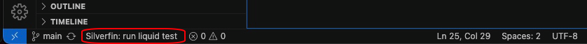
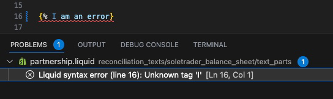

# Silverfin Development Toolkit

This extension aims to support the creation of **Liquid templates** with the [Silverfin Templating Language](https://developer.silverfin.com/docs) and the development of [Liquid testing YAML](https://developer.silverfin.com/docs/liquid-testing) files.

## Setup & Basic Usage

### Authorisation

Before installing the Silverfin Extension, you should first authenticate your device. Your device must be authenticated with the Silverfin API so the Silverfin extension can interact with the Silverfin Platform. For this you will need to contact Silverfin to receive a **Client ID** and **Client Secret**, and then add these credentials as environment variables on your local machine.

If you already have the Silverfin CLI installed, your device should already possess the relevant credentials, in which case no further action is required. Otherwise, please refer to the installation instructions for the [Silverfin CLI](https://github.com/silverfin/silverfin-cli). While installing the Silverfin CLI itself is optional, the instructions also include detailed step-by-step instructions on how to authenticate your device. Please follow these instuctions to complete authentication.

### Install Silverfin Extension

Once your device has been authenticated, the next stage is to download the extension itself. The [Silverfin Development Toolkit extension](https://marketplace.visualstudio.com/items?itemName=Silverfin.silverfin-development-toolkit) can be found in the VS Code Marketplace (you will need to have the version 1.0.0 or higher)

### Liquid testing

#### Prevalidation of YAML files

Tests for liquid templates are written in YAML, and to support the process of writting those tests, this extension includes a **JSON Schema** which is going to be validated against your YAML files.
This will help you out to detect possible errors while defining those tests (e.g: missing required arguments or duplicated keys) without having to wait to run those tests.
This SCHEMA is going to be applied to files which name ends with `_liquid_test.yml`.

#### Running a test

You can run your Liquid Tests directly from VS Code using the button at the bottom of the application.

First, navigate to the relevant test `.yml` file, then press the "Silverfin: run liquid test" button.

---

_NOTE:_ You will need to set the firm ID before you can run any tests. Please refer to "Using the Command Palette" section below\_

---

On pressing the button, a dropdown will appear of all available tests, including the option to run _all_ tests.

Choose the test you wish to run. The test(s) will either pass, or any issues will be detailed in the problems panel at the bottom of VS Code. As well as highlighting problems, the extension will also suggest **potential fixes** to issues if the fault lies within the YAML code. You can view and apply these suggestions by hovering over the yellow lightbulb () that will appear when placing your cursor on the line with the error .

Running a specific test will visualize the test results alongside the YAML file itself, rendering how the template will appear with the inputted dummy data.

#### Using the Command Palette

You can access additional commands using the VS Code Command Palette.

As before, first navigate to the relevant test `.yml` file.

Then access the Command Palette either by using the shortcut Shift + Control + p (Shift + Command + p for Mac) or via the Application Menu by clicking View > Command Palette.

From there if you type in 'Silverfin' you will be given a choice of commands. The most relevant commands are likely to be:

| Command                                                                | Description                                                                                                     |
| ---------------------------------------------------------------------- | --------------------------------------------------------------------------------------------------------------- |
| Silverfin: run specific liquid test (with HTML output from Input view) | Same as pressing the test button                                                                                |
| Silverfin: run all liquid tests                                        | Shortcut to run all liquid tests                                                                                |
| Silverfin: erase stored details of previous test runs (current)        | Clears problems panel                                                                                           |
| Silverfin: set active firm ID\*                                        | Set up which firm will be used as a test environment (your tests will be run as if you're working in this firm) |

---

_NOTE:_ You will need to set the Firm ID \*before\* you can run any tests.

---

## Features

### Silverfin Siderbar

After installing the extension you will have access to the new Silverfin Sidebar:

The sidebar will display the following information concerning the currently selected liquid template:

- **Parts:** A list of the associated parts and shared parts, including links to the listed (shared) parts enabling easy navigation.
- **Template Information:** Meta information such as it appears on the Platform e.g. handle, name, reconciliation type, etc.
- **Firms:** A list of firms which utilise the selected template and a list of firms for which you have authorised the API to work with.

This extension will also check if you are trying to include a shared part in your liquid that does not exist (in general / in your current set default firm) or if you are using a shared part that hasn't been added to the template yet. In the last case, it will give you a warning and will suggest to add it with the click of a button.

### Syntax Highlighting

This extension provides you with a default set of rules for Silverfin Liquid syntax highlighting and you can further customize the colors to your heart's desire.

### Auto Linting

Tests for liquid templates are written in YAML, and to support the process of writing those tests, this extension includes a **JSON Schema** which is going to be validated against your YAML files.
This will help you out to detect possible errors while defining those tests (e.g: missing required arguments or duplicated keys) without having to wait to run those tests.

This SCHEMA is going to be applied to files that end with `_liquid_test.yml`.

You can run your Liquid Tests directly from VS Code with the click of a button and visualize the test results on top of the YAML file itself (You must have a registered API with Silverfin to have access to these features).
If you are running individual tests, you can also see the results of the test in the output panel (an HTML version of your template).

In addition, this extension will enable **code snippets** for `.liquid` & liquid testing `.yml` files. Please refer to **Snippets** section below for a full list of snippets.

## Snippets

This extension adds snippets to make your writing of liquid templates for Silverfin blazingly fast!

Any formatting choices that are made within the Snippets are made according to the [Liquid guidelines](https://developer.silverfin.com/docs/liquid-guidelines).

Snippets are available for the following categories:
 - Tags
 - Filters
 - Drops
 - Tables

### Drops
When selecting a drop snippet, you will have two options to choose from:
 - [some_drop]
 - [some_drop].

The first option will _close_ the drop

The second option, with the period, will continue the drop. On selecting this snippet, you will be given a list of available sub-drops for that drop. First navigate to the relevant sub-drop. If you wish to close off the drop, select the sub-drop you require using the mouse or by pressing enter. However, _if you wish to continue the drop_, instead start to type in the name of the required sub-drop, and then select the relevant snippet as before.

Some drops contain _identical_ sub-drops e.g. first exists for _both_ the accounts and the people drop. In such cases, you will be provided multiple snippets to choose from, so please pick the one with the relevant description.

#### Ctrl + Space
If you position your cursor at the end of a drop e.g. [period.accounts] and press Ctrl + Space, you will also be provided a list of the available snippets, which you can select to access the list of sub-drops

 

## Silverfin Snippets Reference

<!DOCTYPE html>
<html lang="en">
<body>
  <table>
    <tbody>
      <!-- STYLE SNIPPETS -->
      <tr>
        <td colspan="2">
          <h3>Style Snippets</h3>  
        </td>
      </tr>
      <tr>
        <td colspan="2"><b>Styling</b></td>
      </tr>
      <tr>
        <td><code>stripnewlines</code></td>
        <td>Add opening and closing <code>stripnewlines</code></td>
      </tr>
      <tr>
        <td><code>endstripnewlines</code></td>
        <td>Only add closing <code>endstripnewlines</code> tag</td>
      </tr>
      <tr>
        <td><code>newline</code></td>
        <td>Add a <code>newline</code> tag</td>
      </tr>
      <tr>
        <td><code>indent</code></td>
        <td>Add an <code>indent</code> tag with the possible indentation levels listed</td>
      </tr>
      <tr>
        <td><code>fontsize</code></td>
        <td>Add a <code>font</code> tag with the possible options for font-size listed</td>
      </tr>
      <tr>
        <td><code>fontcolor</code></td>
        <td>Add a <code>font</code> tag with the hex-colour attribute included</td>
      </tr>
      <tr>
        <td><code>infotextinline</code></td>
        <td>Add <em>inline</em> <code>infotext</code> inside <code>ic</code> tags</td>
      </tr>
      <tr>
        <td><code>infotextblock</code></td>
        <td>Add <em>full-width</em> <code>infotext</code> inside <code>ic</code> tags</td>
      </tr>
      <tr>
        <td><code>infotexthover</code></td>
        <td>Add <code>infotext</code> with the as="hover" attribute</td>
      </tr>
      <tr>
        <td><code>warningtextinline</code></td>
        <td>Add <em>inline</em> <code>warningtext</code> inside <code>ic</code> tags</td>
      </tr>
      <tr>
        <td><code>warningtextblock</code></td>
        <td>Add <em>full-width</em> <code>warningtext</code> inside <code>ic</code> tags</td>
      </tr>
      <tr>
        <td><code>warningtexthover</code></td>
        <td>Add <code>warningtext</code> tag with the as="hover" attribute</td>
      </tr>
      <tr>
        <td colspan="2">&emsp;</td>
      </tr>
      <!-- HTML styling -->
      <tr>
        <td colspan="2"><b>HTML styling</b></td>
      </tr>
      <tr>
        <td><code>&lt;p&gt;</code></td>
        <td>Add opening and closing <code>&lt;p&gt;</code> tags for paragraph text formatting in HTML</td>
      </tr>
      <tr>
        <td><code>br</code></td>
        <td>Add an HTML line-break tag</td>
      </tr>
      <tr>
        <td><code>hr</code></td>
        <td>Add horizontal rule tag in HTML</td>
      </tr>
      <tr>
        <td><code>b</code></td>
        <td>Add opening and closing <code>&lt;b&gt;</code> tags for bold text formatting in HTML</td>
      </tr>
      <tr>
        <td><code>i</code></td>
        <td>Add opening and closing <code>&lt;i&gt;</code> tags for italic text formatting in HTML</td>
      </tr>
      <tr>
        <td><code>u</code></td>
        <td>Add opening and closing <code>&lt;u&gt;</code> tags for underlined text formatting in HTML</td>
      </tr>
      <tr>
        <td><code>em</code></td>
        <td>Add opening and closing <code>&lt;em&gt;</code> tags for emphasized (italic) text formatting in HTML</td>
      </tr>
      <tr>
        <td><code>strong</code></td>
        <td>Add opening and closing <code>&lt;strong&gt;</code> tags for strong (bold) text formatting in HTML</td>
      </tr>
      <tr>
        <td><code>sub</code></td>
        <td>Add opening and closing <code>&lt;sub&gt;</code> tags for subscript text formatting in HTML</td>
      </tr>
      <tr>
        <td><code>sup</code></td>
        <td>Add opening and closing <code>&lt;sup&gt;</code> tags for superscript text formatting in HTML</td>
      </tr>
      <tr>
        <td><code>h1, h2, h3, h4, h5, h6</code></td>
        <td>
          Add opening and closing tags for section heading text formatting in HTML. <code>&lt;h1&gt;</code> is the largest heading and <code>&lt;h6&gt;</code> is the smallest. 
          <strong>Cannot</strong> be used inside HTML tables within a Liquid template
        </td>
      </tr>
      <tr>
        <td><code>a, anchor</code></td>
        <td>Add opening and closing <code>&lt;a&gt;</code> tags for hyperlink text formatting in HTML</td>
      </tr>
      <tr>
        <td colspan="2">&emsp;</td>
      </tr>
      <!-- TAG SNIPPETS -->
      <tr>
        <td colspan="2">
          <h3>Tag Snippets</h3>  
        </td>
      </tr>
      <!-- Comments -->
      <tr>
        <td colspan="2"><b>Comments</b></td>
      </tr>
      <tr>
        <td><code>comment</code></td>
        <td>Add opening and closing <code>comment</code> tags</td>
      </tr>
      <tr>
        <td><code>endcomment</code></td>
        <td>Only add the closing <code>comment</code> tag</td>
      </tr>
      <tr>
        <td><code>ic</code></td>
        <td>Add opening and closing <code>ic</code> tags (input only)</td>
      </tr>
      <tr>
        <td><code>endic</code></td>
        <td>Only add the closing <code>ic</code> tag (input only)</td>
      </tr>
      <tr>
        <td><code>nic</code></td>
        <td>Add opening and closing <code>nic</code> tags (export only)</td>
      </tr>
      <tr>
        <td><code>endnic</code></td>
        <td>Only add the closing <code>nic</code> tag (export only)</td>
      </tr>
      <tr>
        <td colspan="2">&emsp;</td>
      </tr>
      <!-- Variables -->
      <tr>
        <td colspan="2"><b>Variables</b></td>
      </tr>
      <tr>
        <td><code>assign</code></td>
        <td>Add an <code>assign</code> tag for variables</td>
      </tr>
      <tr>
        <td><code>assign [dynamic]</code></td>
        <td>Add an <code>assign</code> tag for dynamic variables</td>
      </tr>
      <tr>
        <td><code>capture</code></td>
        <td>Add opening and closing <code>capture</code> tags</td>
      </tr>
      <tr>
        <td><code>endcapture</code></td>
        <td>Only add the closing <code>capture</code> tag</td>
      </tr>
      <tr>
        <td colspan="2">&emsp;</td>
      </tr>
      <!-- Translations -->
      <tr>
        <td colspan="2"><b>Translations</b></td>
      </tr>
      <tr>
        <td><code>t=</code></td>
        <td>Set a translation with a default (different languages to be set depending on market)</td>
      </tr>
      <tr>
        <td><code>t</code></td>
        <td>Call a defined translation</td>
      </tr>
      <tr>
        <td colspan="2">&emsp;</td>
      </tr>
      <!-- Input -->
      <tr>
        <td colspan="2"><b>Input</b></td>
      </tr>
      <tr>
        <td><code>input</code></td>
        <td>Add a standard text-input</td>
      </tr>
      <tr>
        <td><code>&emsp;as:text</code></td>
        <td>Add the attribute for a textarea input</td>
      </tr>
      <tr>
        <td><code>&emsp;as:currency</code></td>
        <td>Add the attribute for a currency input</td>
      </tr>
      <tr>
        <td><code>&emsp;&emsp;as:currency,invert:true</code></td>
        <td>Add the attribute for a currency input with inverted value stored in database</td>
      </tr>
      <tr>
        <td><code>&emsp;&emsp;precision:</code></td>
        <td>Add the sub-attribute to define the precision on a currency input</td>
      </tr>
      <tr>
        <td><code>&emsp;as:integer</code></td>
        <td>Add the attribute for an integer input</td>
      </tr>
      <tr>
        <td><code>&emsp;as:percentage</code></td>
        <td>Add the attribute for a percentage input</td>
      </tr>
      <tr>
        <td><code>&emsp;&emsp;precision:</code></td>
        <td>Add the sub-attribute to define the precision on a percentage input</td>
      </tr>
      <tr>
        <td><code>&emsp;&emsp;strip_insignificant_zeros</code></td>
        <td>Add the sub-attribute to strip the final decimal zeros from a percentage value on an input</td>
      </tr>
      <tr>
        <td><code>&emsp;as:boolean</code></td>
        <td>Add the attribute for a boolean input</td>
      </tr>
      <tr>
        <td><code>&emsp;&emsp;autoreload:</code></td>
        <td>Add the sub-attribute to a boolean input to auto-reload</td>
      </tr>
      <tr>
        <td><code>&emsp;as:date</code></td>
        <td>Add the attribute for a date input</td>
      </tr>
      <tr>
        <td><code>&emsp;&emsp;format:</code></td>
        <td>Add the sub-attribute to define the date format display inside an input</td>
      </tr>
      <tr>
        <td><code>&emsp;as:file</code></td>
        <td>Add the attribute for a file input</td>
      </tr>
      <tr>
        <td><code>&emsp;&emsp;show_label:</code></td>
        <td>Add the sub-attribute to add a label to file input field</td>
      </tr>
      <tr>
        <td><code>&emsp;&emsp;max_size:</code></td>
        <td>Add the sub-attribute to limit size (in MB) of files users can attach</td>
      </tr>
      <tr>
        <td><code>&emsp;&emsp;document</code></td>
        <td>Add the attribute to show name of the (first) attached documents of a relevant custom value</td>
      </tr>
      <tr>
        <td><code>&emsp;&emsp;documents</code></td>
        <td>Add the attribute to show names of all attached documents of a relevant custom value</td>
      </tr>
      <tr>
        <td><code>&emsp;&emsp;[some documents].size</code></td>
        <td>Count number of files attached of a relevant custom value</td>
      </tr>
      <tr>
        <td><code>&emsp;&emsp;[some document].file_name</code></td>
        <td>Render name of relevant document</td>
      </tr>
      <tr>
        <td><code>&emsp;&emsp;[some document].link</code></td>
        <td>Render link to preview of relevant document</td>
      </tr>
      <tr>
        <td><code>&emsp;&emsp;as:select</code></td>
        <td>Add the attribute for a select input</td>
      </tr>
      <tr>
        <td><code>&emsp;&emsp;options:</code></td>
        <td>Add the options sub-attribute to a select input</td>
      </tr>
      <tr>
        <td><code>&emsp;&emsp;option_values:</code></td>
        <td>Add the option_values sub-attribute to a select input</td>
      </tr>
      <tr>
        <td><code>&emsp;as:account_collection</code></td>
        <td>Add the attribute for an account collection input</td>
      </tr>
      <tr>
        <td><code>&emsp;&emsp;range:</code></td>
        <td>Add the range sub-attribute to an account collection input</td>
      </tr>
      <tr>
        <td><code>&emsp;placeholder:</code></td>
        <td>Add the placeholder attribute to an input</td>
      </tr>
      <tr>
        <td><code>&emsp;required:</code></td>
        <td>Add the required attribute to an input</td>
      </tr>
      <tr>
        <td><code>&emsp;default:</code></td>
        <td>Add the default attribute or filter to an input or variable</td>
      </tr>
      <tr>
        <td><code>&emsp;import_title:</code></td>
        <td>Add import_title attribute to _both_ fori loops and inputs within fori loop when importing reconciliation data to distinguish between different collections</td>
      </tr>
      <tr>
        <td><code>&emsp;assign:</code></td>
        <td>Add the assign attribute to assign input value to a variable</td>
      </tr>
      <tr>
        <td colspan="2">&emsp;</td>
      </tr>
      <!-- Radio Group -->
      <tr>
        <td colspan="2"><b>Radio Group</b></td>
      </tr>
      <tr>
        <td><code>radiogroup</code></td>
        <td>Add a radio button input group</td>
      </tr>
      <tr>
        <td><code>radioinput</code></td>
        <td>Add individual buttons within a radio button group</td>
      </tr>
      <tr>
        <td><code>&emsp;autoreload:</code></td>
        <td>Add the attribute to a radiogroup tag to auto-reload</td>
      </tr>
      <tr>
        <td colspan="2">&emsp;</td>
      </tr>
      <!-- Control Flow -->
      <tr>
        <td colspan="2"><b>Control Flow</b></td>
      </tr>
      <tr>
        <td><code>if</code></td>
        <td>Add opening and closing <code>if</code> tags</td>
      </tr>
      <tr>
        <td><code>if else</code></td>
        <td>Add opening and closing <code>if</code> tags with <code>else</code> statement</td>
      </tr>
      <tr>
        <td><code>endif</code></td>
        <td>Only add closing <code>if</code> tag</td>
      </tr>
      <tr>
        <td><code>else</code></td>
        <td>Only add <code>else</code> tag</td>
      </tr>
      <tr>
        <td><code>elsif</code></td>
        <td>Only add <code>elsif</code> tag</td>
      </tr>
      <tr>
        <td><code>ifi</code></td>
        <td>Add opening and closing <code>ifi</code> tags</td>
      </tr>
      <tr>
        <td><code>endifi</code></td>
        <td>Only add closing <code>ifi</code> tag</td>
      </tr>
      <tr>
        <td><code>unless</code></td>
        <td>Add opening and closing <code>unless</code> tags</td>
      </tr>
      <tr>
        <td><code>endunless</code></td>
        <td>Only add closing <code>unless</code> tag</td>
      </tr>
      <tr>
        <td><code>case</code></td>
        <td>Add opening and closing <code>case</code> tags with a <code>when</code> and <code>else</code> statement</td>
      </tr>
      <tr>
        <td><code>endcase</code></td>
        <td>Only add closing <code>case</code> tag</td>
      </tr>
      <tr>
        <td><code>when</code></td>
        <td>Add a <code>when</code> tag that is used within <code>case</code> tags</td>
      </tr>
      <tr>
        <td colspan="2">&emsp;</td>
      </tr>
      <!-- Iterations -->
      <tr>
        <td colspan="2"><b>Iterations</b></td>
      </tr>
      <tr>
        <td><code>for</code></td>
        <td>Add opening and closing <code>for</code> loop tags</td>
      </tr>
      <tr>
        <td><code>endfor</code></td>
        <td>Only add a closing <code>for</code> loop tag</td>
      </tr>
      <tr>
        <td><code>&emsp;limit</code></td>
        <td>Add the limit attribute to a for loop</td>
      </tr>
      <tr>
        <td><code>&emsp;offset</code></td>
        <td>Add the offset attribute to a for loop</td>
      </tr>
      <tr>
        <td><code>&emsp;reversed</code></td>
        <td>Add the reversed attribute to a for loop</td>
      </tr>
      <tr>
        <td><code>fori</code></td>
        <td>Add opening and closing <code>fori</code> loop tags</td>
      </tr>
      <tr>
        <td><code>endfori</code></td>
        <td>Only add a closing <code>fori</code> loop tag</td>
      </tr>
      <tr>
        <td><code>&emsp;import_title</code></td>
        <td>Add import_title attribute to _both_ fori loops and inputs within fori loop when importing reconciliation data to distinguish between different collections</td>
      </tr>
      <tr>
        <td><code>forloop.index</code></td>
        <td>Add the forloop.index variable inside a for loop</td>
      </tr>
      <tr>
        <td><code>forloop.index0</code></td>
        <td>Add the forloop.index0 variable inside a for loop</td>
      </tr>
      <tr>
        <td><code>forloop.first</code></td>
        <td>Add the forloop.first variable inside a for loop</td>
      </tr>
      <tr>
        <td><code>forloop.last</code></td>
        <td>Add the forloop.last variable inside a for loop</td>
      </tr>
      <tr>
        <td><code>break</code></td>
        <td>Add the <code>break</code> tag inside a for loop</td>
      </tr>
      <tr>
        <td><code>continue</code></td>
        <td>Add the <code>continue</code> inside a for loop</td>
      </tr>
      <tr>
        <td colspan="2">&emsp;</td>
      </tr>
      <!-- Unreconciled -->
      <tr>
        <td colspan="2"><b>Unreconciled</b></td>
      </tr>
      <tr>
        <td><code>unreconciled</code></td>
        <td>Add the <code>unreconciled</code> tag as an indicator with unreconciled text</td>
      </tr>
      <tr>
        <td><code>unreconciled-withoutindicator</code></td>
        <td>Add the <code>unreconciled</code> tag as an indicator with unreconciled text</td>
      </tr>
      <tr>
        <td colspan="2">&emsp;</td>
      </tr>
      <!-- Result -->
      <tr>
        <td colspan="2"><b>Result</b></td>
      </tr>
      <tr>
        <td><code>result</code></td>
        <td>Add a <code>result</code> tag</td>
      </tr>
      <tr>
        <td colspan="2">&emsp;</td>
      </tr>
      <!-- Rollforward -->
      <tr>
        <td colspan="2"><b>Rollforward</b></td>
      </tr>
      <tr>
        <td><code>rollforward</code></td>
        <td>Add a <code>rollforward</code> tag</td>
      </tr>
      <tr>
        <td><code>&emsp;as:file</code></td>
        <td>Add as:file attribute to a <code>rollforward</code> tag </td>
      </tr>
      <tr>
        <td><code>rollforward.period</code></td>
        <td>Add the <code>rollforward.period</code> variable</td>
      </tr>
      <tr>
        <td colspan="2">&emsp;</td>
      </tr>
      <!-- Locale -->
      <tr>
        <td colspan="2"><b>Locale</b></td>
      </tr>
      <tr>
        <td><code>locale</code></td>
        <td>Add opening and closing <code>locale</code> tags</td>
      </tr>
      <tr>
        <td><code>endlocale</code></td>
        <td>Only add closing <code>locale</code> tag</td>
      </tr>
      <tr>
        <td colspan="2">&emsp;</td>
      </tr>
      <!-- Include -->
      <tr>
        <td colspan="2"><b>Include</b></td>
      </tr>
      <tr>
        <td><code>include</code></td>
        <td>Add a tag to include a local or shared part</td>
      </tr>
      <tr>
        <td colspan="2">&emsp;</td>
      </tr>
      <!-- Linkto -->
      <tr>
        <td colspan="2"><b>Linkto</b></td>
      </tr>
      <tr>
        <td><code>linkto</code></td>
        <td>Add opening and closing <code>linkto</code> tags</td>
      </tr>
      <tr>
        <td><code>endlinkto</code></td>
        <td>Only add closing <code>linkto</code> tag</td>
      </tr>
      <tr>
        <td><code>&emsp;target:</code></td>
        <td>Add a target attribute to a <code>linkto</code> tag</td>
      </tr>
      <tr>
        <td><code>&emsp;new_tab:</code></td>
        <td>Add a new_tab attribute to a <code>linkto</code> tag</td>
      </tr>
      <tr>
        <td><code>&emsp;as:button</code></td>
        <td>Add the attribute for a button to a <code>linkto</code> tag</td>
      </tr>
      <tr>
        <td><code>target</code></td>
        <td>Add a <code>target</code> tag with an id</td>
      </tr>
      <tr>
        <td colspan="2">&emsp;</td>
      </tr>
      <!-- Adjustment button -->
      <tr>
        <td colspan="2"><b>Adjustment Button</b></td>
      </tr>
      <tr>
        <td><code>adjustmentbutton</code></td>
        <td>Add opening and closing <code>adjustmentbutton</code> tags</td>
      </tr>
      <tr>
        <td><code>adjustmentbuttonwithpurpose</code></td>
        <td>Add an <code>adjustmentbutton</code> tag with a purpose attribute</td>
      </tr>
      <tr>
        <td><code>endadjustmentbutton</code></td>
        <td>Only add closing <code>adjustmentbutton</code> tag</td>
      </tr>
      <tr>
        <td><code>adjustmenttransaction</code></td>
        <td>Add <code>adjustmenttransaction</code> tag</td>
      </tr>
      <tr>
        <td colspan="2">&emsp;</td>
      </tr>
      <!-- Group -->
      <tr>
        <td colspan="2"><b>Group</b></td>
      </tr>
      <tr>
        <td><code>group</code></td>
        <td>Add a closing and opening <code>group</code> tag inside <code>nic</code> tags</td>
      </tr>
      <tr>
        <td colspan="2">&emsp;</td>
      </tr>
      <!-- Add new inputs -->
      <tr>
        <td colspan="2"><b>Add New Inputs</b></td>
      </tr>
      <tr>
        <td><code>addnewinputs</code></td>
        <td>Add opening and closing <code>addnewinputs</code> tags</td>
      </tr>
      <tr>
        <td><code>endaddnewinputs</code></td>
        <td>Only add closing <code>addnewinputs</code> tag</td>
      </tr>
      <tr>
        <td colspan="2">&emsp;</td>
      </tr>
      <!-- Signmarker -->
      <tr>
        <td colspan="2"><b>Signmarker</b></td>
      </tr>
      <tr>
        <td><code>signmarker</code></td>
        <td>Add a <code>signmarker</code> tag</td>
      </tr>
      <tr>
        <td colspan="2">&emsp;</td>
      </tr>
      <!-- Push & Pop -->
      <tr>
        <td colspan="2"><b>Push & Pop</b></td>
      </tr>
      <tr>
        <td><code>push</code></td>
        <td>Add a <code>push</code> tag</td>
      </tr>
      <tr>
        <td><code>pop</code></td>
        <td>Add a <code>pop</code> tag</td>
      </tr>
      <tr>
        <td colspan="2">&emsp;</td>
      </tr>
      <!-- Change orientation -->
      <tr>
        <td colspan="2"><b>Change Orientation</b></td>
      </tr>
      <tr>
        <td><code>changeorientation</code></td>
        <td>Add a <code>changeorientation</code> tag</td>
      </tr>
      <tr>
        <td colspan="2">&emsp;</td>
      </tr>
      <!-- Currency configuration -->
      <tr>
        <td colspan="2"><b>Currency Configuration</b></td>
      </tr>
      <tr>
        <td><code>currencyconfiguration</code></td>
        <td>Add opening and closing <code>currencyconfiguration</code> tags with the possible attributes</td>
      </tr>
      <tr>
        <td><code>endcurrencyconfiguration</code></td>
        <td>Only add closing <code>currencyconfiguration</code> tag</td>
      </tr>
      <tr>
        <td><code>&emsp;zero_format</code></td>
        <td>Add attribute to set format of zeroes to "0" or "-"</td>
      </tr>
      <tr>
        <td><code>&emsp;negative_format</code></td>
        <td>Add attribute to set format of negative numbers to "-xxx" or "(xxx)"</td>
      </tr>
      <tr>
        <td><code>&emsp;precision</code></td>
        <td>Add attribute to set number of decimal places</td>
      </tr>
      <tr>
        <td><code>&emsp;delimiter</code></td>
        <td>Add attribute to set style of delimiters to "x,xxx", "x.xxx", "xxxx", or "x xxx"</td>
      </tr>
      <tr>
        <td><code>&emsp;separator</code></td>
        <td>Add attribute to set style of decimal separator to either "x,xx" or "x.xx"</td>
      </tr>
      <tr>
        <td colspan="2">&emsp;</td>
      </tr>
      <!-- New page -->
      <tr>
        <td colspan="2"><b>New Page</b></td>
      </tr>
      <tr>
        <td><code>newpage</code></td>
        <td>Add a newpage tag to signify the start of a new page in the PDF export with optional orientation attribute</td>
      </tr>
      <tr>
        <td><code>section_break</code></td>
        <td>Add the attribute to create section breaks within input mode</td>
      </tr>
      <tr>
        <td colspan="2">&emsp;</td>
      </tr>
      <!-- DROPS SNIPPETS -->
      <tr>
        <td colspan="2">
          <h3>Drops Snippets</h3>  
        </td>
      </tr>
      <!-- Account drops -->
      <!-- <tr>
        <td colspan="2"><b>Account Drops</b></td>
      </tr>
      <tr>
        <td colspan="2">&emsp;</td>
      </tr> -->
      <!-- Accounts drops -->
      <tr>
        <td colspan="2"><b>Accounts Drops</b></td>
      </tr>
      <tr>
        <td>
          <code>accounts.starred</code> 
          <code>accounts.assets</code> 
          <code>accounts.liabilities</code> 
          <code>accounts.revenues</code> 
          <code>accounts.expenses</code> 
          <code>accounts.income</code> 
          <code>accounts.equity</code>
        </td>
        <td>Return an accounts drop with only specified accounts type</td>
      </tr>
      <tr>
        <td><code>accounts.count</code></td>
        <td>Return number of account drops in the accounts drop</td>
      </tr>
      <tr>
        <td><code>accounts.credit_value</code></td>
        <td>Return sum of credit value of all accounts in the accounts drop</td>
      </tr>
      <tr>
        <td><code>accounts.debit_value</code></td>
        <td>Return sum of debit value of all accounts in rhe accounts drop</td>
      </tr>
      <tr>
        <td><code>accounts.first</code></td>
        <td>Return the first account drop of the accounts drop</td>
      </tr>
      <tr>
        <td><code>accounts.include_zeros</code></td>
        <td>Return an accounts drop that includes <em>all</em> accounts, including those with a zero balance</td>
      </tr>
      <tr>
        <td><code>accounts.name</code></td>
        <td>Return the name of the first account in this drop</td>
      </tr>
      <tr>
        <td>
          <code>accounts.</code> 
          <code>p_and_l_rounding_difference</code>, 
          <code>accounts.</code> 
          <code>bs_rounding_difference</code>
        </td>
        <td>Display the exact Profit & Loss/ Balance Sheet rounding difference when using the core rounding functionality</td>
      </tr>
      <tr>
        <td>
          <code>accounts. p_and_l_rounding_account</code>, 
          <code>accounts. bs_rounding_account</code>
        </td>
        <td>Return the account drop where the Profit & Loss/ Balance Sheet rounding difference is stored</td>
      </tr>
      <tr>
        <td>
          <code>accounts.</code> 
          <code></code>return_values_in_millions</code></td>
        <td>Display the value of the individual account drops in the created accounts drop in millions</td>
      </tr>
      <tr>
        <td>
          <code>accounts.</code> 
          <code>return_values_in_thousands</code>
        </td>
        <td>Display the value of the individual account drops in the created accounts drop in thousands</td>
      </tr>
      <tr>
        <td><code>accounts.value</code></td>
        <td>Return the sum of all values for all accounts in this accounts drop for this period</td>
      </tr>
      <tr>
        <td colspan="2">&emsp;</td>
      </tr>
      <!-- Company drops -->
      <tr>
        <td colspan="2"><b>Company Drops</b></td>
      </tr>
      <tr>
        <td>
          <code>company.</code> 
          <code>analytical_type_(0..x)_codes</code>
        </td>
        <td>Returns drop with information about dimensions/companies in an analytical/consolidation file</td>
      </tr>
      <tr>
        <td><code>company.city</code></td>
        <td>Return the city from the company settings</td>
      </tr>
      <tr>
        <td><code>company.company_form</code></td>
        <td>Return the company form from the company settings</td>
      </tr>
      <tr>
        <td><code>company.company_type</code></td>
        <td>Return the company type from company settings</td>
      </tr>
      <tr>
        <td><code>company.country</code></td>
        <td>Return the country from the company settings</td>
      </tr>
      <tr>
        <td><code>company.country_code</code></td>
        <td>Return the country code based upon the country from the company settings</td>
      </tr>
      <tr>
        <td><code>company.currency</code></td>
        <td>Return the currency code from the company settings</td>
      </tr>
      <tr>
        <td><code>company.custom</code></td>
        <td>Attach custom information to a company, independant of the period</td>
      </tr>
      <tr>
        <td><code>company.file_code</code></td>
        <td>Return the file number from the company settings</td>
      </tr>
      <tr>
        <td><code>company.locales</code></td>
        <td>Return the available languages for the company</td>
      </tr>
      <tr>
        <td><code>company.name</code></td>
        <td>Return the company name from the company settings</td>
      </tr>
      <tr>
        <td><code>company.periods_per_year</code></td>
        <td>Returns 1,4,12 depending on the reporting frequency (yearly, quarterly or monthly)</td>
      </tr>
      <tr>
        <td><code>company.postalcode</code></td>
        <td>Return the post code from the company settings</td>
      </tr>
      <tr>
        <td><code>company.street</code></td>
        <td>Return the street from the company settings</td>
      </tr>
      <tr>
        <td><code>company.vat_identifier</code></td>
        <td>Return the vat identifier from the company settings</td>
      </tr>
      <tr>
        <td colspan="2">&emsp;</td>
      </tr>
      <!-- Custom drops -->
      <!-- People drops -->
      <tr>
        <td><code>people.count</code></td>
        <td>Return of count of number of person drops within the people drop (can also use with directors and shareholders drops)</td>
      </tr>
      <tr>
        <td><code>people.first</code></td>
        <td>Return first the person drop in the people drop (can also use with directors and shareholders drops)</td>
      </tr>
      <tr>
        <td>
          <code>directors.</code> 
          <code>active_as_director</code>
        </td>
        <td>Add the filter for directors which returns those directors active during the book year</td>
      </tr>
      <tr>
        <td>
          <code>directors.</code> 
          <code>active_as_director_on</code>
        </td>
        <td>Add the filter for directors which returns those directors active in a specific date</td>
      </tr>
      <tr>
        <td colspan="2">&emsp;</td>
      </tr>
      <!-- Period -->  
      <tr>
        <td colspan="2"><b>Period Drops</b></td>
      </tr>
      <tr>
        <td><code>period.accounts</code></td>
        <td>Return an accounts drop of all accounts with bookings on this period</td>
      </tr>
      <tr>
        <td>
          <code>period.</code> 
          <code>account_mapping_list.</code> 
          <code>name</code>
        </td>
        <td>Return the name of the mapping list used for this period</td>
      </tr>
      <tr>
        <td>
          <code>period.</code> 
          <code>account_mapping_list.</code> 
          <code>id</code>
        </td>
        <td>Return the id of the mapping list on firm level</td>
      </tr>
      <tr>
        <td>
          <code>period.</code> 
          <code>account_mapping_list.</code> 
          <code>marketplace_template_id</code>
        </td>
        <td>Return the id of the mapping list on the marketplace</td>
      </tr>
      <tr>
        <td><code>period.adjustments</code></td>
        <td>Return adjustments drop of all adjustments for the period</td>
      </tr>
      <tr>
        <td><code>period.bookyear_index</code></td>
        <td>Return the index number of the current book year as an integer. The first book year equals 1</td>
      </tr>
      <tr>
        <td><code>period.calendar_years</code></td>
        <td>
          Add the method to add an array of all calendar years in the fiscal year. The information for each calendar year is: 
          start_date, end_date, amount_of_days for the number of days the bookyear has in the calendar year, and amount_of_days_in_full_year for the total number of days in the calendar year
      </td>
      </tr>
      <tr>
        <td><code>period.custom</code></td>
        <td>Attach custom information to a period. This is done <em>automatically</em> in reconciliations</td>
      </tr>
      <tr>
        <td><code>period.directors</code></td>
        <td>Return a people drop of all individuals who are directors</td>
      </tr>
      <tr>
        <td><code>period.end_date</code></td>
        <td>Return the date this period ends</td>
      </tr>
      <tr>
        <td><code>period.exists</code></td>
        <td>Return true when the period exists in the Silverfin database</td>
      </tr>
      <tr>
        <td><code>period.fiscal_year</code></td>
        <td>Return the fiscal year of this period</td>
      </tr>
      <tr>
        <td><code>period.is_first_year</code></td>
        <td>Return true if the period is in the first book year of this client file</td>
      </tr>
      <tr>
        <td><code>period.month_end_dates</code></td>
        <td>Return an array of all the end dates of the calendar months in this fiscal year</td>
      </tr>
      <tr>
        <td><code>period.name</code></td>
        <td>Return the name of the period</td>
      </tr>
      <tr>
        <td><code>period.people</code></td>
        <td>
          Return the people drop of all people attached to the period (typically copied from general company level)
        </td>
      </tr>
      <tr>
        <td><code>period.reconciliations</code></td>
        <td>
          Return a reconciliations drop of all reconciliations for this period. You can ask for a specific reconciliation by adding the handle. I.e. period.reconciliations.the_handle.
        </td>
      </tr>
      <tr>
        <td><code>period.reports</code></td>
        <td>Return a reports drop of all reports for this period. You can ask for a specific report by adding the handle. I.e. period.reports.the_handle</td>
      </tr>
      <tr>
        <td><code>period.shareholders</code></td>
        <td>Return a people drop of all individuals who are shareholders</td>
      </tr>
      <tr>
        <td><code>period.start_date</code></td>
        <td>Return the date this period starts</td>
      </tr>
      <tr>
        <td><code>period.year_end</code></td>
        <td>Return the period at the end of the fiscal year this period is in</td>
      </tr>
      <tr>
        <td><code>period.year_end_date</code></td>
        <td>Return the date of the end of the fiscal year of this period</td>
      </tr>
      <tr>
        <td><code>period.year_start_date</code></td>
        <td>Return the date of the start of the fiscal year of this period</td>
      </tr>
      <tr>
        <td><code>period.minus__xp/y</code></td>
        <td>Return the period drop of the current period minus the amount of periods or years defined</td>
      </tr>
      <tr>
        <td><code>period.plus__xp/y</code></td>
        <td>Return the period drop of the current period plus the amount of periods or years defined</td>
      </tr>
      <tr>
        <td colspan="2">&emsp;</td>
      </tr>
      <!-- Reconciliations -->
      <tr>
        <td colspan="2"><b>Reconciliations Drops</b></td>
      </tr>
      <tr>
        <td><code>reconciliations.count</code></td>
        <td>Returns the number of active reconciliations</td>
      </tr>
      <tr style>
        <td>
          <code>reconciliations.</code> 
          <code>[reconciliation_handle]</code> *
          </td>
        <td>
          Return the specific reconcilaition with matching handle 
          * <i>Don't actually use the word handle but use that handle of the specific reconciliation instead</i>
        </td>
      </tr>
      <tr>
        <td><code>reconciliations.star</code></td>
        <td>Return reconciliations drop of all starred reconciliations</td>
      </tr>
      <tr>
        <td colspan="2">&emsp;</td>
      </tr>
      <!-- User drops -->
      <tr>
        <td colspan="2"><b>User Drops</b></td>
      </tr>
      <tr>
        <td><code>user.name</code></td>
        <td>Return name of the current Silverfin user</td>
      </tr>
      <tr>
        <td><code>user.email</code></td>
        <td>Return email address of the current Silverfin user</td>
      </tr>
      <tr>
        <td colspan="2">&emsp;</td>
      </tr>
      <!-- FILTER SNIPPETS -->
      <tr>
        <td colspan="2">
          <h3>Filter Snippets</h3>
        </td>
      </tr>
      <!-- Allow false -->
      <tr>
        <td colspan="2"><b>Allow False</b></td>
      </tr>
      <tr>
        <td><code>allow_false</code></td>
        <td>Add the filter to allow falsy values not to be overwritten by defaults</td>
      </tr>
      <tr>
        <td colspan="2">&emsp;</td>
      </tr>
      <!-- Array -->
      <tr>
        <td colspan="2"><b>Array</b></td>
      </tr>
      <tr>
        <td><code>concat</code></td>
        <td>Add filter to combine two arrays</td>
      </tr>
      <tr>
        <td><code>split</code></td>
        <td>Add filter to split a String into an array</td>
      </tr>
      <tr>
        <td><code>first</code></td>
        <td>Add filter to return the first value of an array</td>
      </tr>
      <tr>
        <td><code>last</code></td>
        <td>Add filter to return the last value of an array</td>
      </tr>
      <tr>
        <td><code>join</code></td>
        <td>Add filter to transform an array into a String</td>
      </tr>
      <tr>
        <td><code>sort</code></td>
        <td>Add filter to sort an array alphabetically</td>
      </tr>
      <tr>
        <td><code>uniq</code></td>
        <td>Add filter to remove duplicate values from an array</td>
      </tr>
      <tr>
        <td><code>reverse</code></td>
        <td>Add filter to reverse order of items in an array</td>
      </tr>
      <tr>
        <td colspan="2">&emsp;</td>
      </tr>
      <!-- Collection -->
      <tr>
        <td colspan="2"><b>Collection</b></td>
      </tr>
      <tr>
        <td><code>concat</code></td>
        <td>Add filter to combine two collections</td>
      </tr>
      <tr>
        <td><code>map</code></td>
        <td>Add filter to create array from collection</td>
      </tr>
      <tr>
        <td><code>range</code></td>
        <td>Add filter to <strong>accounts collection</strong> to return accounts in a given range</td>
      </tr>
      <tr>
        <td><code>group_by</code></td>
        <td>Add filter to group items of collection by a specified field</td>
      </tr>
      <tr>
        <td><code>index_by</code></td>
        <td>Add filter to reference item by an alternate index</td>
      </tr>
      <tr>
        <td><code>where</code></td>
        <td>Add filter to create array from collection, only including items which meet specified condition </td>
      </tr>
      <tr>
        <td><code>analytical_code</code></td>
        <td>Add filter to <strong>accounts collection</strong> to return accounts for specified dimension/company code</td>
      </tr>
      <tr>
        <td><code>add_rounding_difference</code></td>
        <td>Add filter to <strong>accounts collection</strong> to remove (and reallocate) decimal values</td>
      </tr>
      <tr>
        <td colspan="2">&emsp;</td>
      </tr>
      <!-- Date and time -->
      <tr>
        <td colspan="2"><b>Date and Time</b></td>
      </tr>
      <tr>
        <td><code>date:"%d/%m/%Y"</code></td>
        <td>Add filter for standard BE date formatting (DD/MM/YYYY)</td>
      </tr>
      <tr>
        <td><code>date:"%F"</code></td>
        <td>Add filter for ISO date formatting (YYYY-MM-DD)</td>
      </tr>
      <tr>
        <td><code>"now"</code></td>
        <td>Display today's date</td>
      </tr>
      <tr>
        <td><code>localized_date</code></td>
        <td>Display a date according to the time-zone from where template is being executed</td>
      </tr>
      <tr>
        <td><code>advance_years</code></td>
        <td>Add filter to advance date by specified number of years</td>
      </tr>
      <tr>
        <td><code>advance_months</code></td>
        <td>Add filter to advance date by specified number of months</td>
      </tr>
      <tr>
        <td><code>advance_weeks</code></td>
        <td>Add filter to advance date by specified number of weeks</td>
      </tr>
      <tr>
        <td><code>advance_days</code></td>
        <td>Add filter to advance date by specified number of days</td>
      </tr>
      <tr>
        <td><code>advance_hours</code></td>
        <td>Add filter to advance date by specified number of hours</td>
      </tr>
      <tr>
        <td><code>advance_minutes</code></td>
        <td>Add filter to advance date by specified number of minutes</td>
      </tr>
      <tr>
        <td><code>advance_seconds</code></td>
        <td>Add filter to advance date by specified number of seconds</td>
      </tr>
      <tr>
        <td><code>retract_years</code></td>
        <td>Add filter to retract date by specified number of years</td>
      </tr>
      <tr>
        <td><code>retract_months</code></td>
        <td>Add filter to retract date by specified number of months</td>
      </tr>
      <tr>
        <td><code>retract_weeks</code></td>
        <td>Add filter to retract date by specified number of weeks</td>
      </tr>
      <tr>
        <td><code>retract_days</code></td>
        <td>Add filter to retract date by specified number of days</td>
      </tr>
      <tr>
        <td><code>retract_hours</code></td>
        <td>Add filter to retract date by specified number of hours</td>
      </tr>
      <tr>
        <td><code>retract_minutes</code></td>
        <td>Add filter to retract date by specified number of minutes</td>
      </tr>
      <tr>
        <td><code>retract_seconds</code></td>
        <td>Add filter to retract date by specified number of seconds</td>
      </tr>
      <tr>
        <td colspan="2">&emsp;</td>
      </tr>
      <!-- Localized -->
      <tr>
        <td colspan="2"><b>Localized</b></td>
      </tr>
      <tr>
        <td><code>localized</code></td>
        <td>Add filter on custom input drop with localized attribute, to retrieve value in local language</td>
      </tr>
      <tr>
        <td><code>localized:</code></td>
        <td>Add functionality to a text input <em>only</em>, to store text in local language</td>
      </tr>
      <tr>
        <td colspan="2">&emsp;</td>
      </tr>
      <!-- Number -->
      <tr>
        <td colspan="2"><b>Number</b></td>
      </tr>
      <tr>
        <td><code>abs</code></td>
        <td>Add filter to return the absolute value of a number</td>
      </tr>
      <tr>
        <td><code>ABS (function)</code></td>
        <td>Add function to return absolute value from wrapped input</td>
      </tr>
      <tr>
        <td><code>ceil</code></td>
        <td>Add filter to return value rounded-up</td>
      </tr>
      <tr>
        <td><code>floor</code></td>
        <td>Add filter to return value rounded-down</td>
      </tr>
      <tr>
        <td><code>currency</code></td>
        <td>Add filter to return a value in the currency format</td>
      </tr>
      <tr>
        <td><code>&emsp;invert</code></td>
        <td>Add filter to invert value of inputed accounts - <em>only</em> works with currency filter</td>
      </tr>
      <tr>
        <td><code>integer</code></td>
        <td>Add filter to convert value to the nearest whole number</td>
      </tr>
      <tr>
        <td><code>INT (function)</code></td>
        <td>Add function to convert wrapped input to nearest whole number</td>
      </tr>
      <tr>
        <td><code>percentage</code></td>
        <td>Add filter to return value as percentage</td>
      </tr>
      <tr>
        <td><code>number_to_human</code></td>
        <td>Add filter to convert inputted accounts into combination of integers + English words e.g. "287 Thousand"</td>
      </tr>
      <tr>
        <td><code>number_to_currency</code></td>
        <td>Add filter to convert a <em>string</em> value to the currency format</td>
      </tr>
      <tr>
        <td><code>round</code></td>
        <td>Add filter to return s rounded value (with default of two decimal places)</td>
      </tr>
      <tr>
        <td><code>modulo</code></td>
        <td>Add filter to divide value by a number and return the remainder</td>
      </tr>
      <tr>
        <td><code>MAX (function)</code></td>
        <td>Add the MAX function to return the largest value of an array of numbers</td>
      </tr>
      <tr>
        <td><code>MIN (function)</code></td>
        <td>Add the MIN function to return the smallest value in an array of numbers</td>
      </tr>
      <tr>
        <td><code>at_least</code></td>
        <td>Add filter to limit input to a minimum value</td>
      </tr>
      <tr>
        <td><code>at_most</code></td>
        <td>Add filter to limit input to a maximum value</td>
      </tr>
      <tr>
        <td colspan="2">&emsp;</td>
      </tr>
      <!-- String -->
      <tr>
        <td colspan="2"><b>String</b></td>
      </tr>
      <tr>
        <td><code>remove</code></td>
        <td>Add filter to removes substring from a given string</td>
      </tr>
      <tr>
        <td><code>replace</code></td>
        <td>Add filter to replace substring A with substring B within a given string</td>
      </tr>
      <tr>
        <td><code>upcase</code></td>
        <td>Add filter to transform all letters of a given string into uppercase</td>
      </tr>
      <tr>
        <td><code>downcase</code></td>
        <td>Add filter to transform all letters of a given string into lowercase</td>
      </tr>
      <tr>
        <td><code>capitalize</code></td>
        <td>Add filter to capitalise <em>each</em> word in a given string</td>
      </tr>
      <tr>
        <td><code>append</code></td>
        <td>Add filter to attach String B to the end of String A</td>
      </tr>
      <tr>
        <td><code>prepend</code></td>
        <td>Add filter to attach String B at the start of String B</td>
      </tr>
      <tr>
        <td><code>size</code></td>
        <td>Add filter to return the number of characters within a given String</td>
      </tr>
      <tr>
        <td><code>strip</code></td>
        <td>Add filter to string any whitespaces at the start and end of a given string</td>
      </tr>
      <tr>
        <td><code>default</code></td>
        <td>Add attribute to a string variable to return a default value <em>if</em> no value stored in the variable</td>
      </tr>
      <tr>
        <td><code>slice</code></td>
        <td>Add filter to return a substring of a given String, beginning from a certain index for a certain length</td>
      </tr>
      <tr>
        <td><code>newline_to_br / multiline_table</code></td>
        <td>Add filter to replace every newline character ("\n") with an HTML line break ("&lt;br&gt;")</td>
      </tr>
      <tr>
        <td><code>string_value</code></td>
        <td>Add filter to return a value from a variable or drop as a String rather than the inferred data type</td>
      </tr>
      <tr>
        <td><code>url_encode</code></td>
        <td>Add filter to replace any URL-unsafe character with three characters: a percent sign and the corresponding Hex value of the character replaced</td>
      </tr>
      <tr>
        <td><code>url_decode</code></td>
        <td>Add filter to decode a String encoded by the above url_encode filter</td>
      </tr>
      <tr>
        <td><code>strip_html</code></td>
        <td>Add filter to remove any HTML tags from a String</td>
      </tr>
      <tr>
        <td><code>md5</code></td>
        <td>Converts a string into an MD5 hash</td>
      </tr>
      <tr>
        <td><code>transliterate</code></td>
        <td>Transliterates strings based on the Unicoder library</td>
      </tr>
      <tr>
        <td colspan="2">&emsp;</td>
      </tr>
      <!-- TABLE SNIPPETS -->
      <tr>
        <td colspan="2">
          <h3>Table Snippets</h3>
        </td>
      </tr>
      <!-- HTML Elements -->
      <tr>
        <td colspan="2"><b>HTML Elements</b></td>
      </tr>
      <!-- Table Elements -->
      <tr>
        <td colspan="2"><i>Table Elements</i></td>
      </tr>
      <tr>
        <td><code>table</code></td>
        <td>Add snippet for a minimal HTML table with a header, body, and width classes defined</td>
      </tr>
      <tr>
        <td><code>thead</code></td>
        <td>Add opening and closing <code>&lt;thead&gt;</code> tags for an HTML table</td>
      </tr>
      <tr>
        <td><code>tbody</code></td>
        <td>Add opening and closing <code>&lt;tbody&gt;</code> tags for an HTML table</td>
      </tr>
      <tr>
        <td><code>tr</code></td>
        <td>Add opening and closing <code>&lt;tr&gt;</code> tags for an HTML table with nested <code>&lt;td&gt;</code> elements</td>
      </tr>
      <tr>
        <td><code>th</code></td>
        <td>Add opening and closing <code>&lt;th&gt;</code> tags for an HTML table</td>
      </tr>
      <tr>
        <td><code>td</code></td>
        <td>Add opening and closing <code>&lt;td&gt;</code> tags for an HTML table</td>
      </tr>
      <tr>
        <td colspan="2">&emsp;</td>
      </tr>
      <!-- Text Formatting Elements -->
      <tr>
        <td colspan="2"><i>Text Formatting Elements</i></td>
      </tr>
      <tr>
        <td><code>br</code></td>
        <td>Add an HTML line-break tag</td>
      </tr>
      <tr>
        <td><code>b</code></td>
        <td>Add opening and closing <code>&lt;b&gt;</code> tags for bold text formatting in HTML</td>
      </tr>
      <tr>
        <td><code>i</code></td>
        <td>Add opening and closing <code>&lt;i&gt;</code> tags for italic text formatting in HTML</td>
      </tr>
      <tr>
        <td><code>u</code></td>
        <td>Add opening and closing <code>&lt;u&gt;</code> tags for underlined text formatting in HTML</td>
      </tr>
      <tr>
        <td><code>em</code></td>
        <td>Add opening and closing <code>&lt;em&gt;</code> tags for emphasized (italic) text formatting in HTML</td>
      </tr>
      <tr>
        <td><code>sub</code></td>
        <td>Add opening and closing <code>&lt;sub&gt;</code> tags for subscript text formatting in HTML</td>
      </tr>
      <tr>
        <td><code>sup</code></td>
        <td>Add opening and closing <code>&lt;sup&gt;</code> tags for superscript text formatting in HTML</td>
      </tr>
      <tr>
        <td colspan="2">&emsp;</td>
      </tr>
      <!-- HTML Attributes -->
      <tr>
        <td colspan="2"><b>HTML Attributes</b></td>
      </tr>
      <tr>
        <td><code>class</code></td>
        <td>Add <code>class</code> attribute to HTML elements</td>
      </tr>
      <tr>
        <td><code>colspan</code></td>
        <td>Add <code>colspan</code> attribute to HTML <code>&lt;td&gt;</code> or <code>&lt;th&gt;</code> element</td>
      </tr>
      <tr>
        <td colspan="2">&emsp;</td>
      </tr>
      <!-- CSS Classes -->
      <tr>
        <td colspan="2"><b>CSS Classes</b></td>
      </tr>
      <!-- Alignment Classes -->
      <tr>
        <td colspan="2"><i>Alignment Classes</i></td>
      </tr>
      <tr>
        <td><code>usr-width-</code></td>
        <td>Add <code>usr-width-*</code> class to set element width</td>
      </tr>
      <tr>
        <td><code>usr-align-left</code></td>
        <td>Add <code>usr-align-left</code> class to align text left</td>
      </tr>
      <tr>
        <td><code>usr-align-center</code></td>
        <td>Add <code>usr-align-center</code> class to align text center</td>
      </tr>
      <tr>
        <td><code>usr-align-right</code></td>
        <td>Add <code>usr-align-right</code> class to align text right</td>
      </tr>
      <tr>
        <td><code>usr-align-justify</code></td>
        <td>Add <code>usr-align-justify</code> class to justify text</td>
      </tr>
      <tr>
        <td><code>usr-valign-top</code></td>
        <td>Add <code>usr-valign-top</code> class to vertically align content to top</td>
      </tr>
      <tr>
        <td><code>usr-valign-center</code></td>
        <td>Add <code>usr-valign-center</code> class to vertically align content to center</td>
      </tr>
      <tr>
        <td><code>usr-valign-bottom</code></td>
        <td>Add <code>usr-valign-bottom</code> class to vertically align content to bottom</td>
      </tr>
      <tr>
        <td colspan="2">&emsp;</td>
      </tr>
      <!-- Border Classes -->
      <tr>
        <td colspan="2"><i>Border Classes</i></td>
      </tr>
      <tr>
        <td><code>usr-line-top</code></td>
        <td>Add <code>usr-line-top</code> class to add a top border</td>
      </tr>
      <tr>
        <td><code>usr-line-bottom</code></td>
        <td>Add <code>usr-line-bottom</code> class to add a bottom border</td>
      </tr>
      <tr>
        <td><code>usr-line-left</code></td>
        <td>Add <code>usr-line-left</code> class to add a left border</td>
      </tr>
      <tr>
        <td><code>usr-line-right</code></td>
        <td>Add <code>usr-line-right</code> class to add a right border</td>
      </tr>
      <tr>
        <td><code>usr-double-line-top</code></td>
        <td>Add <code>usr-double-line-top</code> class to add a double top border</td>
      </tr>
      <tr>
        <td><code>usr-double-line-bottom</code></td>
        <td>Add <code>usr-double-line-bottom</code> class to add a double bottom border</td>
      </tr>
      <tr>
        <td><code>usr-double-line-left</code></td>
        <td>Add <code>usr-double-line-left</code> class to add a double left border</td>
      </tr>
      <tr>
        <td><code>usr-double-line-right</code></td>
        <td>Add <code>usr-double-line-right</code> class to add a double right border</td>
      </tr>
      <tr>
        <td colspan="2">&emsp;</td>
      </tr>
      <!-- Color and Styling Classes -->
      <tr>
        <td colspan="2"><i>Color and Styling Classes</i></td>
      </tr>
      <tr>
        <td><code>usr-border-color-*</code></td>
        <td>Add class to set table cell border color in Hex</td>
      </tr>
      <tr>
        <td><code>usr-background-color-*</code></td>
        <td>Add class to set table cell background color in Hex</td>
      </tr>
      <tr>
        <td><code>usr-indent-*</code></td>
        <td>Add <code>usr-indent-*</code> class to indent content</td>
      </tr>
      <tr>
        <td><code>usr-repeated-header</code></td>
        <td>Add <code>usr-repeated-header</code> class to repeat table header on new pages in PDF export</td>
      </tr>
      <tr>
        <td><code>usr-no-left-padding</code></td>
        <td>Add <code>usr-no-left-padding</code> class to remove default left padding</td>
      </tr>
      <tr>
        <td><code>usr-grayed-out-background-input</code></td>
        <td>Add class to set table cell background to gray</td>
      </tr>
      <tr>
        <td><code>usr-grayed-out-line-bottom-input</code></td>
        <td>Add class to set faint table cell bottom lines</td>
      </tr>
      <tr>
        <td><code>usr-hide-samepage-header</code></td>
        <td>Add <code>usr-hide-samepage-header</code> class to hide header when content continues on same page</td>
      </tr>
    </tbody>
  </table>
</body>
</html>

## Third party extensions

- YAML extension: To apply our Schema to YAML files, we need to have [Red Hat's YAML extension](https://marketplace.visualstudio.com/items?itemName=redhat.vscode-yaml) activated (this extension should be added automatically since it is set as a dependency).
- Auto Close Tag: To enable VS Code to automatically close HTML tags in Liquid files, we need to have [Jun Han's Auto Close Tag](https://marketplace.visualstudio.com/items?itemName=formulahendry.auto-close-tag) activated (this extension should be added automatically since it is set as a dependency).

